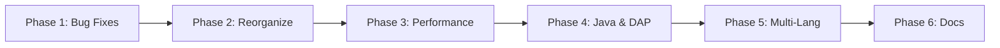

# Roadmap: fabiosouzadev/neovim

**Created:** 2026-05-15
**Milestone:** v1.0 — Professionalization & Multi-Language Support
**Phases:** 6 | **Requirements:** 43

## Overview

| # | Phase | Goal | Requirements | Success Criteria |
|---|-------|------|--------------|------------------|
| 1 | Bug Fixes & Code Cleanup | Resolve all known issues and remove dead code | BUGS-01..05, CLEAN-01..07 | 4 |
| 2 | Plugin Reorganization | Clean architecture with one-file-per-plugin pattern | REORG-01..04 | 3 |
| 3 | Performance Optimization | Fast startup and efficient lazy-loading | PERF-01..04 | 3 |
| 4 | Java & DAP Enhancements | Improve Java support and debugging infrastructure | JAVA-01..04, DAP-01..02 | 4 |
| 5 | Multi-Language Support | Full TypeScript, Python, and PHP support | TSJS-01..05, PY-01..05, PHP-01..05 | 5 |
| 6 | Documentation | Comprehensive bilingual documentation | DOCS-01..06 | 4 |

---

### Phase 1: Bug Fixes & Code Cleanup
**Goal:** Resolve all 12 identified concerns and remove dead code without structural changes
**Requirements:** BUGS-01, BUGS-02, BUGS-03, BUGS-04, BUGS-05, CLEAN-01, CLEAN-02, CLEAN-03, CLEAN-04, CLEAN-05, CLEAN-06, CLEAN-07
**Success Criteria:**
1. `nvim --headless +qa` exits cleanly with no errors
2. No LazyVim references remain in codebase (grep returns 0 matches for `LazyVim`, `lazyvim`)
3. No commented-out Telescope, mason-tool-installer, or toggleterm blocks remain
4. All Lua files use Unix (LF) line endings (verified by `file *.lua`)

---

### Phase 2: Plugin Reorganization
**Goal:** Consolidate Snacks configs, validate one-file-per-plugin pattern, and centralize Mason ensure_installed
**Requirements:** REORG-01, REORG-02, REORG-03, REORG-04
**Success Criteria:**
1. Snacks config exists as a single file with all features (picker, dashboard, explorer, notifier, indent, scroll, words, scope)
2. Every plugin file contains exactly one plugin spec (except multi-plugin files like colorschemes)
3. All Mason `ensure_installed` declarations use `opts_extend` pattern for composability

---

### Phase 3: Performance Optimization
**Goal:** Establish performance baseline and optimize lazy-loading for fastest possible startup
**Requirements:** PERF-01, PERF-02, PERF-03, PERF-04
**Success Criteria:**
1. Startup time measured and documented (baseline vs optimized)
2. No plugins loaded at startup unless strictly necessary (`lazy = false` audit complete)
3. `:Lazy profile` shows no plugin taking >50ms to load

---

### Phase 4: Java & DAP Enhancements
**Goal:** Fix Java-specific bugs and enhance debugging infrastructure for all languages
**Requirements:** JAVA-01, JAVA-02, JAVA-03, JAVA-04, DAP-01, DAP-02
**Success Criteria:**
1. Opening a Java file shows no error notifications — JDTLS attaches cleanly
2. blink.cmp completions work fully in Java files (LSP capabilities enabled)
3. `nvim-dap-virtual-text` displays variable values inline during debug sessions
4. Java runtime paths resolve dynamically via `mise where` (no hardcoded paths)

---

### Phase 5: Multi-Language Support
**Goal:** Add full development support (LSP + DAP + format + lint + treesitter) for TypeScript, Python, and PHP
**Requirements:** TSJS-01, TSJS-02, TSJS-03, TSJS-04, TSJS-05, PY-01, PY-02, PY-03, PY-04, PY-05, PHP-01, PHP-02, PHP-03, PHP-04, PHP-05
**Success Criteria:**
1. TypeScript: Opening a `.ts` file triggers LSP attach, formatting works on save, eslint diagnostics appear
2. Python: Opening a `.py` file triggers LSP attach, ruff formatting works on save, ruff diagnostics appear
3. PHP: Opening a `.php` file triggers LSP attach, php-cs-fixer works on save, phpstan diagnostics appear
4. All three languages: DAP can set breakpoints and step through code
5. `:Mason` shows all required tools installed (ts_ls, basedpyright, intelephense, prettier, ruff, php-cs-fixer, eslint, phpstan, debugpy, js-debug-adapter, php-debug-adapter)

---

### Phase 6: Documentation
**Goal:** Create comprehensive bilingual documentation for other users to onboard
**Requirements:** DOCS-01, DOCS-02, DOCS-03, DOCS-04, DOCS-05, DOCS-06
**Success Criteria:**
1. README.md exists in English with installation instructions, keybind table, and plugin list
2. README-pt_br.md exists in Portuguese with equivalent content
3. A new user can clone the repo and get a working Neovim setup following only the README
4. Architecture section explains directory structure and design decisions

---

## Phase Dependencies

Phases are sequential — each builds on the foundation of the previous.

---
*Roadmap created: 2026-05-15*
*Last updated: 2026-05-15 after initial definition*
