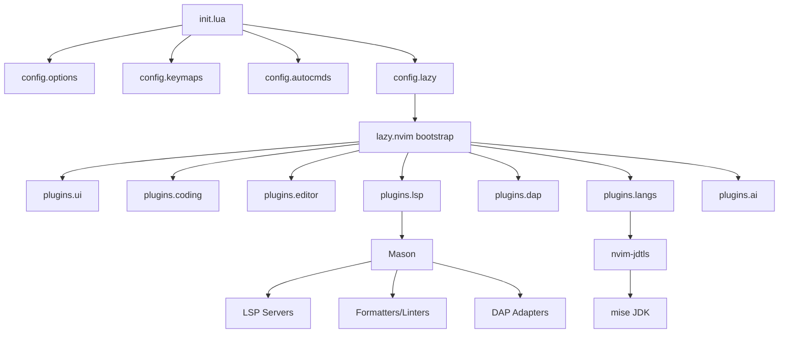

# Architecture

> Last mapped: 2026-05-15

## Overview

This is a personal Neovim configuration built from scratch (not a Neovim distribution like LazyVim), using **lazy.nvim** as the plugin manager. The configuration follows a **modular plugin architecture** where each plugin is isolated in its own file, organized by functional category.

## Architectural Pattern

```
Single Entry Point → Core Config → Category-based Plugin Loading
```

The configuration uses a **layered initialization** pattern:

1. **Options** — Global Neovim settings (`options.lua`)
2. **Keymaps** — Core keybindings (`keymaps.lua`)
3. **Autocommands** — Event-driven behaviors (`autocmds.lua`)
4. **Plugins** — Lazy-loaded via category imports (`lazy.lua`)

## Entry Point

```lua
-- init.lua (5 lines)
require("config.options")
require("config.keymaps")
require("config.autocmds")
require("config.lazy")
```

**Critical ordering:** `options` loads first to set `mapleader` before any plugin maps are defined.

## Core Configuration Layer (`lua/config/`)

| File            | Purpose                                    | Lines |
| --------------- | ------------------------------------------ | ----- |
| `options.lua`    | Neovim options, global variables           | 116   |
| `keymaps.lua`    | Core keybindings (leader, diagnostics, nav)| 88    |
| `autocmds.lua`   | Autocommands (yank highlight, file type)   | 120   |
| `lazy.lua`       | Plugin manager bootstrap and plugin loading| 61    |

### Custom Modules (`lua/config/custom/`)

| File                 | Purpose                                     |
| -------------------- | ------------------------------------------- |
| `fidget-spinner.lua`  | CodeCompanion progress indicator via fidget  |

## Plugin Layer (`lua/plugins/`)

Plugins are organized into **7 functional categories**, each auto-imported as a directory by lazy.nvim:

### Category Breakdown

| Category   | Directory             | Plugin Count | Purpose                                |
| ---------- | --------------------- | ------------ | -------------------------------------- |
| **ui**      | `lua/plugins/ui/`     | 7 files      | Visual appearance, search, navigation  |
| **coding**  | `lua/plugins/coding/` | 5 files      | Completion, formatting, linting, pairs |
| **editor**  | `lua/plugins/editor/` | 10 files     | File browsing, git, sessions, search   |
| **lsp**     | `lua/plugins/lsp/`    | 2 files      | LSP servers, Mason, lazydev            |
| **dap**     | `lua/plugins/dap/`    | 1 file       | Debug Adapter Protocol                 |
| **langs**   | `lua/plugins/langs/`  | 1 file       | Language-specific configs (Java)       |
| **ai**      | `lua/plugins/ai/`     | 1 file       | AI-assisted coding (Copilot)           |

## Data Flow



## Key Design Decisions

### 1. LazyVim Influence Without LazyVim Dependency
The config borrows patterns from LazyVim (root detection via `vim.g.root_spec`, `vim.g.trouble_lualine`, `lazyvim_last_loc` marker) without actually depending on the LazyVim distribution. This is a **standalone config** that uses LazyVim conventions.

### 2. Plugin Composition via `opts_extend`
Several plugins use `opts_extend` to allow additive configuration across files:
- `mason.nvim` → `ensure_installed` extended in `lsp/init.lua` and `langs/java.lua`
- `blink.cmp` → `sources.default` extended in `ai/copilot.lua`
- `nvim-treesitter` → `ensure_installed` extended in `langs/java.lua`

### 3. Snacks as Universal UI Layer
`snacks.nvim` is the primary UI framework, configured across 3 separate files:
- `ui/snacks.lua` — Core features (indent, notifier, scroll, words)
- `ui/snacks_dashboard.lua` — Dashboard layout
- `ui/snacks_picker.lua` — File/search/LSP picker (replaces Telescope)

### 4. Java-First Language Support
The only language with dedicated support is Java, with a comprehensive setup:
- Custom JDTLS launcher via Mason + mise JDK
- Integrated debugging and test runner
- Multiple JDK runtime configurations (11, 21, 26)

## Leader Key Structure

**Leader:** `<Space>` | **Local Leader:** `\`

| Prefix       | Domain                           |
| ------------ | -------------------------------- |
| `<leader>c`   | Code (format, diagnostics, LSP)  |
| `<leader>d`   | Debug (DAP operations)           |
| `<leader>f`   | File/Find                        |
| `<leader>g`   | Git (signs, picker, GitHub)      |
| `<leader>gh`  | Git Hunks                        |
| `<leader>h`   | Harpoon                          |
| `<leader>l`   | Lazy (plugin manager)            |
| `<leader>q`   | Quit/Session                     |
| `<leader>s`   | Search                           |
| `<leader>t`   | Test (Java-specific) / Terminal  |
| `<leader>u`   | UI toggles                       |
| `<leader>x`   | Diagnostics/Quickfix             |
